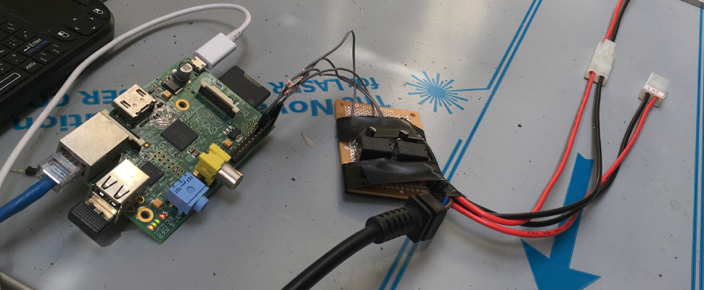
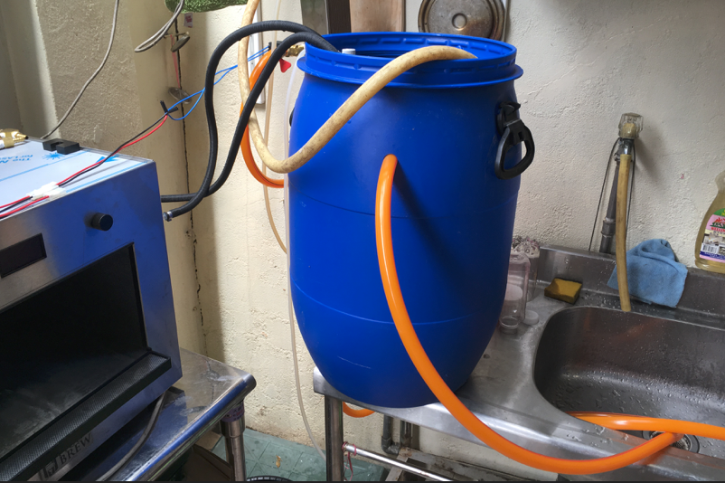
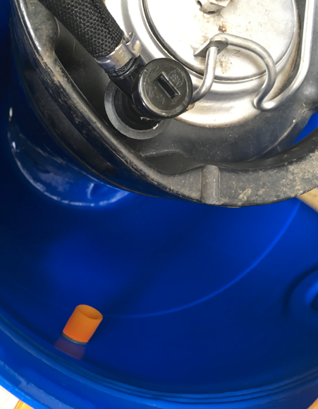

# pico-extension
Tools and instructions to DIY a PicoBrew automation improvement, like chill and sparge    
這是一個自動化專案，提供工具與指引協助你強化PICOBrew全自動釀酒系統，補上全自動最後一塊拼圖。

這裡你可以看到我的自動化的展示，如果你願意，你可以打造屬於你自己的裝置！

## Why?   
[PicoBrew Zymatic](https://www.picobrew.com/Store/products/zymatic.cshtml) 是一套美國製造的全自動釀酒系統，面對有經驗的釀酒師。他可以幾乎全自動化的完成釀酒的多數程序，穩定的品質與一致性協助釀酒師可以微調自己的譜，學習物料特性，免受手工帶來的不確定性的干擾。同時，這也是一個節省時間的神器 - 一個釀酒流程往往耗時五個小時，而有了這個，你不再被綁定在熱鍋前，可以有更多時間去做其他的事。

但，他依然缺了一角。

Pico包含了醣化、煮花的所有階段，但降溫的部分並不在他的設計之中。這導致了一個問題：當你的麥汁完成時，他會處於高溫狀態，而高溫會造成酒花異構物的持續生成，最終成品的苦味會變得高且銳利。如果你沒有及時回來進行降溫，你將會得到一桶苦味大幅偏離預期的酒，即便Zymatic會在煮花階段結束時發出逼逼叫通知你趕快來進行冷卻動作，但這也意味著你得及時趕回來，不能離開同一個樓層太遠。

＊當然你也可以不做冷卻試試看，這裡有([實驗](https://github.com/sakura26/ethanol/blob/master/brewingHistory/170425-ethen-creamale.md))

另一方面，Pico省略的糖化階段的攪拌、對流與洗槽，這導致了奇低的糖化效率 -> 在我的經驗中大約為50-60%之間，跟BIAB差不多，而GrainFather之類的系統一般可以達到75%以上。

PicoBrew is not perfect. The chill is still done by hand, and there is no notification but a "beep sound" to let you know you have to do cold down your wort, that result a bitter and harsh beer. 

also, Pico don't have sparge or stir, so the efficiency is very low around 50-60%, just like BIAB. (GrainFather and someothers can do around 75%)

## My Goal

我的目標是「上班按Play，下班投酵母」。除了讓忙碌的人可以真正釋放出自己的時間，可以連續做各種實驗之於也依然保有相當的品質。

另一方面，我也希望強化Pico的糖化效率問題。一旦能加入洗槽，應該可以大幅提升糖的萃取效果。

My goal is "Push play before goto office, put yeast after back home". So we can take our time for more, and test recipe/ingredient daily.

Also, add sparge step can improve efficiency too.


## Automation for Zymatic

為了實現進一步的自動化，我們必須要做到幾件事

* 至少，每次Step更新的時候能夠主動通知釀造者 （已經完成 -> [PicoFollower](http://picofollower.anotherdream.tw:81/)）
* 自動化抓取Pico的狀態更新 （本專案）
* 製作根據狀態更新連動的外掛裝置 （下面有設計圖）

首先，來看看怎麼樣抓取狀態更新

We have several things to do for automation:

* Get notified when pico step updates, with email/SMS or API
* build a device for sparge/colding

### Get pico status

我開發了兩套系統來處理這個問題。

So I build 2 system as a solution.

#### PicoFollower

其一是[PicoFollower](http://picofollower.anotherdream.tw:81/), 這個網站會協助你從Pico抓取當前的運作狀態，並在每次狀態改變時發送Email/簡訊給你。同時，這網站也提供API，每次呼叫都可以得到Pico當前釀造的譜與階段的資訊，你可以藉由這個系統來製作你自己的自動化外掛，省去自行開發爬蟲與解析器的麻煩。

這個網站還處於測試階段，如果您在使用上面有遇到任何問題，請隨時跟我說讓我強化他。等穩定之後我會再次公開發佈。

One is a website called [PicoFollower](http://picofollower.anotherdream.tw:81/). The website get your pico status from pico's account, and send email/SMS notification to you. Ofcourse, we provide API to get current pico status include "recipe_name:step_name", you can use the API to simplify your automation device. (If you use this website and find bugs or something, please feel free to contact me, I will fix ASAP.)

#### pico-extension (This project)

當然，如果你使用Raspberry Pi之類較強的設備，你也可以直接去Pico網站抓取狀態更新，簡化系統，也可以不用把密碼保留在PicoFollower上（PicoFollower需要暫存你的密碼才有辦法持續為你抓取更新）。這個專案裡面我放了一組可以直接執行的Bash指令稿，你可以透過這些命令稿抓取你的Pico狀態更新。

You can use scripts here to build standalone automation device too. just input your pico website username/password/device id, and you can get the result.

##### Scripts

* getPicoList.sh 列出你所有Pico的設備資訊，你可以在這裡找到你的設備ID（JSON format）

```
bash getPicoList.sh <user> <passwd>
```

* getPicoId.sh 如果你只有一台Pico, 這個script可以立刻取得她的ID

```
bash getPicoId.sh <user> <passwd>
```

* getPicoDeviceStatus.sh 抓取指定裝置的完整狀態（JSON format）

```
bash getPicoDeviceStatus.sh <user> <passwd> <deviceId>
```

* getPicoDeviceStatusName.sh 抓取指定裝置的精簡狀態（ recipe_name:step_name ）

```
bash getPicoDeviceStatusName.sh <user> <passwd> <deviceId>
```

如果你是使用Raspberry Pi來開發你的裝置，這裡有兩個我已經在使用的Script你可以略為修改直接使用。這個程式會在指定的兩個狀態（煮沸、冷卻）發生時啟動相對應的開關，你可以以此控制制水閥來實現洗槽與冷卻。

If you use RPi to develop your device, here is controller I used. don't forget to modify the username/password/device_id variable! The script will turn on the switch in "chill/sparge" step.

* simple_control.py

這是Standalone的版本，呼叫上面的script來抓取pico的狀態。你會需要修改表頭的三個參數（帳號、密碼、設備ID），你可以藉由上面的script來找到你的設備ID。

This one is standalone version, it calls bash script to get status.

* pico_follower_actor.py

這是使用PicoFollower抓取設備資訊的版本，別忘了修改表頭的設備ID, 同時要先去PicoFollower登入過一次讓系統有在監控這個設備。

This one used PicoFollower for monitoring. You will need to login PicoFollower at least once to enable device monitoring.


以上，如果你是一個有經驗的嵌入式系統/IoT開發者，你應該知道接下來要怎麼做了。當然，如果你想要瞭解更多細節，我們繼續吧。

If you know about how to build your own IoT/Embedded device, here is all you need. here is more detail how I made...


### Make your own control board



如果你使用RPi或Arduino開發控制器，後端的制水閥之類的裝置往往會吃比較大的電壓與電流（像我用的是110V），你會需要一個控制板來開關這些裝置，我是follow這篇來做的

If you use RPi or Arduino to develop, you will need a control board to control the higher voltage/current device. I followed this:

<http://www.susa.net/wordpress/2012/06/raspberry-pi-relay-using-gpio/>

  * BC337 / C1815 *2
  * 1k resistor *2
  * 1n4007 *2
  * circuit baord *1
  * some wire to connect to RPi
  * 5v Relay for 110/220V to control Water valve

### Sparge / chill device choice

要做到冷卻有好幾個選擇

* 水槽冷卻法(cooling in water tank) ([降溫實驗](https://github.com/sakura26/ethanol/blob/master/brewingHistory/170618-ethen-%E7%A7%91%E9%9A%86.md))
* 熱板交換器(Plate Chiller)/Counterflow chiller （[降溫實驗](https://github.com/sakura26/ethanol/blob/master/brewingHistory/170619-ethen-%E7%A7%91%E9%9A%86.md)）

這邊我們展示最簡單效果也不差的水槽冷卻法，在我們的測試中20分鐘可以從煮花結束的97度降到45度，已經到達相對安全的範圍，使用水量約40公升內。如果希望效果更好，可以使用更多的水量來實現。

當然，熱板式冷卻器可以有更佳的效率（10分鐘降至45度），但是Pico的泵浦推不動會有問題，這個部分我們還在繼續實驗中。

There is several choose to chill the wort, we use the simplest "water tank chill" here. It can let tempture 97->45℃ in 20mins with 40L water. Of course the Plate Chiller can do better(in 10 mins), but the Zymatic`s pump seems don't have enought power to do so.



材料

* 一個藍色大塑膠桶(60L) （可以讓你的keg桶放入差不多高即可， [我用這種](img/60Lbucket.jpg)）
* 花園用水管一條（買一公尺或以上，根據你的設備與水龍頭間的距離）
* 一個電動制水閥（我使用110V的版本，兩端轉接花園用水管，通電才開）
* 水管固定環3-4個（避免漏水）
* 電鑽與鑽洞用具（圓穴鋸/階梯鑽）（非必要）

首先，把keg桶放入塑膠桶內，在接近keg高度的地方（不超過keg接頭高度）打個洞作為溢流孔（你可以接一段水管上去，把水收集起來再利用）。



水龍頭用水管連接制水閥的入口，出口接管子放到桶內底部，連接處都用固定環強化避免漏水。
制水閥接上控制器，開啟龍頭至適度大小，這樣就完成了

當冷卻階段時，制水閥開啟，冷水流入桶內慢慢上漲，此時桶內麥汁與外部冷卻水持續對流換熱。當桶內水滿，頂部熱水會順著溢流孔排出。

你可以調整龍頭的大小決定一次冷卻會輸出多少水量，水量越多冷得越快

#### last step: cancel the "stop" step in PicoBrew Website Recipe Advanced editor

當你想要啟用自動化冷卻，別忘了到[Pico的網站](https://www.picobrew.com/Members/Recipes/BrowseRecipes.cshtml)上去修改你的譜！預設Pico的譜會有一個Step，在煮花之後把系統停下來等你連接冷卻裝置。由於我們已經做了自動化冷卻，這個暫停階段反而會阻撓我們系統的運作。只要很簡單地把這個"Connect Chiller"的step刪掉即可。

The recipe in picobrew there is a "stop" step called "connect chiller". for fully automation, we should remove this step. you can find it in PicoBrew Website  Recipe->Advanced.

## DEMO

[Video](https://youtu.be/4plyQV4wNKg)